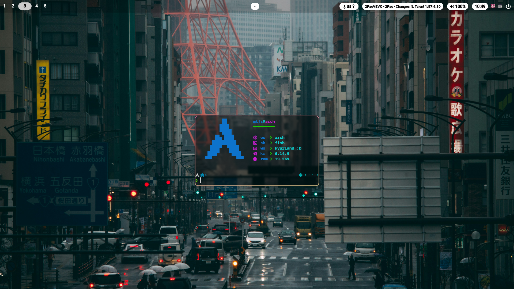
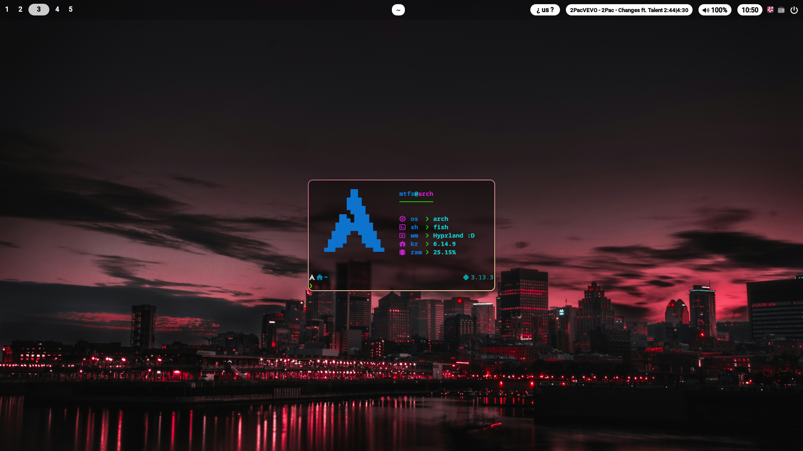
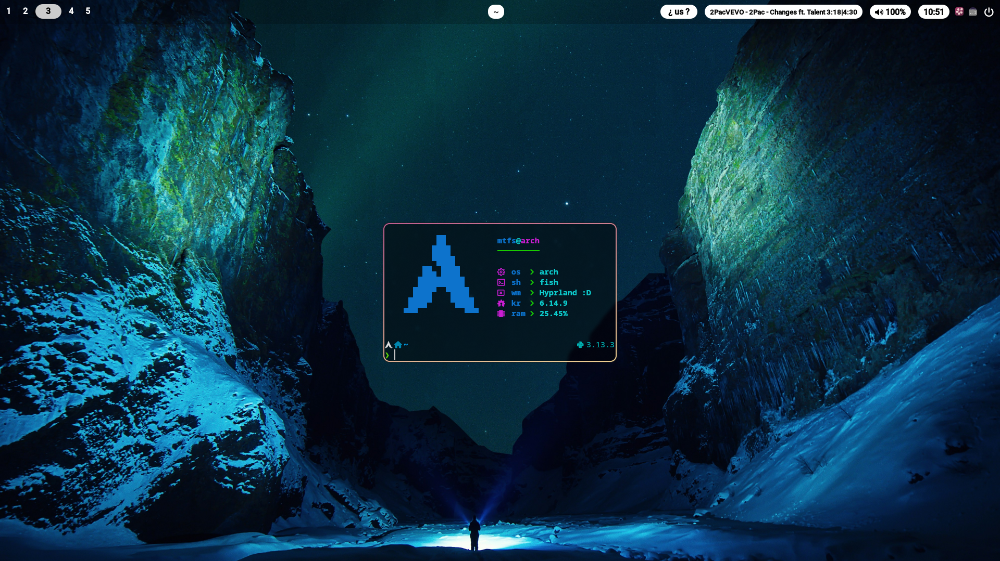
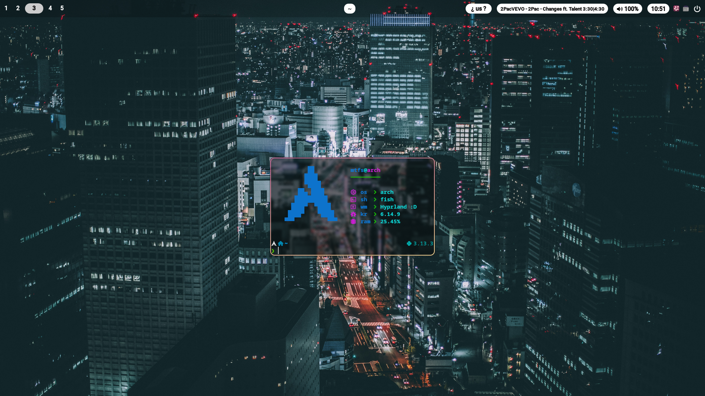
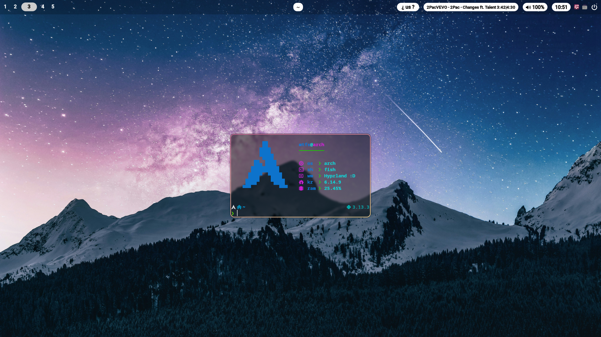
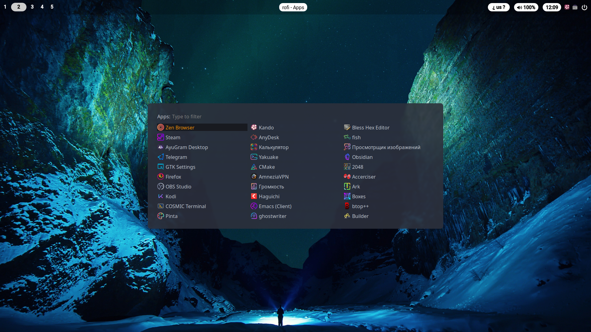

# **[Mutarov](https://github.com/Mutarov) Rice for Hyprland**  

**🌌 A sleek, minimal, and space-themed Hyprland rice with smooth animations and productivity-focused workflow.**  

---

## **🎨 Features**  
✔ **Hyprland** – Dynamic tiling Wayland compositor  
✔ **Waybar** – Highly customizable top bar  
✔ **Rofi** – App launcher & window switcher  
✔ **Flameshot** – Powerful yet simple to use screenshot software  

---

## **📸 Screenshots**  
    
    
    
    
  
  

---

## **⚙️ Installation**  

### **1. Dependencies**  
Ensure you have:  
- **Hyprland** (Wayland compositor)  
- **Waybar** (Top panel)  
- **Rofi** (App launcher)  
- **hyprpaper** (Wallpaper engine)  
- **nwg-look** (GTK theme switcher)  

Install them on **Arch Linux**:  
```bash
sudo pacman -S hyprland waybar rofi nwg-look swaync wl-clipboard
yay -S clipman
```

And for flameshot works just install `flameshot-git` it from AUR:  
```bash
yay -S flameshot-git
```

### **2. Apply the rice**
Clone the repo and copy configs:
```bash
git clone https://github.com/Ryodof/dot-files.git ~/dots && cd ~/dots
cp -r Mutarov/* ~/.config/ && cd -
```

## **⌨️ Keybinds**
| Key                   | Action                       |
|-----------------------|------------------------------|
| Super + Enter         | Open terminal (`kitty`)      |
| Super + Shift + Enter | Launch `rofi`                |
| Super + F             | Toggle fullscreen            | 
| Super + Q             | Close window                 |
| Printscreen           | Screenshot (with `flameshot`)|
| Super + T             | Toggle floating window       |

(Full keybinds in `~/.config/hypr/hyprland.conf`)
